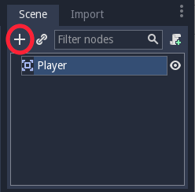
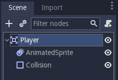
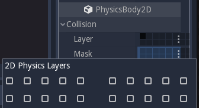
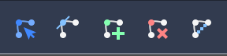
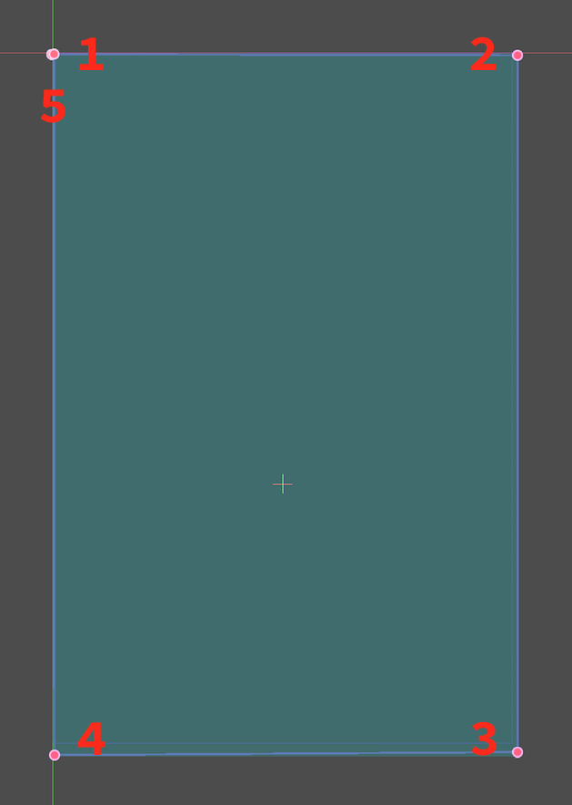
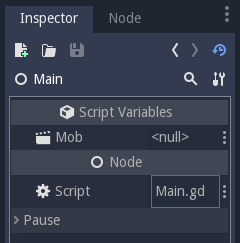
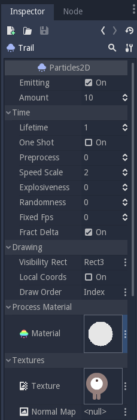
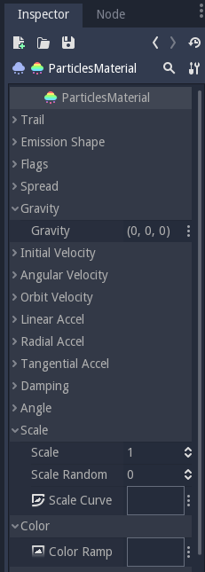

# Your First Game (2D)

## Overview

This tutorial will guide you through making your first Godot Engine project. You will learn how the Godot Engine editor works, how a project is structured, and how to build a 2D game.

>   **Who is this for?**
>   This project is intended to introduce the Godot Engine. It is assumed that you have some programming experience already. If you're new to programming entirely, it is recommended you start with !**LINK FOR BEGINNER PROGRAMMERS**!

The game is called _"Dodge the Creeps"_. Your character must move and avoid the enemies for as long as possible.  Here is a preview of the final result:


>   **Why 2D?**
>    Beginners are urged to focus on 2D projects until they have a good understanding of the game development process. 3D games are significantly more complex, so stick to 2D until you feel confident in your ability.

## Project Setup

Start by launching Godot and making a new project. Then, download the **!LINK TO ASSETS!** _game assets_ - the images and sounds you'll be using.  Unzip these files in your new project folder.

>   For this tutorial, we will assume you are already familiar with the Godot Engine editor window. If you haven't read the **!LINK TO EDITOR OVERVIEW!**, do so now.

This game will use "portrait" mode, so we need to adjust the size of the game window.  Click on `Project>Project Settings>Display>Window` and set `Width` to `480` and `Height` to `720`.

#### Organizing the Project

In this project, we will be making 3 independent scenes: `Player`, `Mob`, and `HUD`, which we will combine into the game's `Main` scene.  In a larger project, it might be useful to make folders to hold the various scenes and their scripts, but for this relatively small game, you can save your scenes and scripts in the root folder, which is called `res:\\`.

## Player Scene

#### Node Structure
To begin, click the "Add/Create a New Node" button and add an `Area2D` node to the scene.



We are using `Area2D` so that we can detect other objects overlapping (i.e. running into) the player. This first node will represent the player, so change its name to `Player`.  We'll add additional nodes to the player to add functionality.

Save the scene (click Scene -> Save, or press `Meta-s`).

>   **A Note on Naming**
>   In this project, we will be following the Godot Engine naming conventions.  Classes (Nodes) use `CapWords`, variables and functions use `snake_case`, and constants use `ALL_CAPS`.

#### Sprite Animation
Click on the `Player` node and add an `AnimatedSprite` node as a child.
The `AnimatedSprite` will handle the appearance and animations for our player. Notice that there is a warning symbol next to the node.  An `AnimatedSprite` requires a `SpriteFrames` resource, which is a list of the animation(s) it can display. To create one, find the `Frames` property in the Inspector and click `<null>` -> `New SpriteFrames`. Next, in the same location, click `<SpriteFrames>` to open the "SpriteFrames" editor window:


On the left is a list of animations. Click the "default" one and rename it to "right".  Then click the "Add" button to create a second animation named "up". Drag the two images for each animation into "Animation Frames" side of the window:


Finally, add a `CollisionShape2D` as a child of the `Player`. This will determine the player's "hitbox" (the bounds of its collision area). For this character, a `CapsuleShape2D` gives the best fit, so next to "Shape" in the Inspector, click `<null>` -> "New CapsuleShape2D".  Resize the shape to cover the sprite:


>   **Tip:** Remember not to scale the shape's outline! Only use the size handles (red) to adjust the shape!

When you're finished, your `Player` scene should look like this:



#### Moving the Player

Now we need to add some functionality that we can't get from a built-in node, so we'll add a script. Click the `Player` node and click the "Add Script" button:


In the script settings window, you can leave the default settings, just click "Create":


>   If this is your first time encountering GDScript please read the **!LINK TO GDSCRIPT OVERVIEW!** first.

Start by declaring the member variables this object will need:

```
extends Area2D

var SPEED = 400  # how fast the player will move (pixels/sec)
var velocity = Vector2()  # the player's movement vector
var screensize  # size of the game window
```
The `ready()` function is called when a node enters the scene tree (i.e. when the object is created), so that's a good time to find the size of the game window:

```
func _ready():
    screensize = get_viewport_rect().size
```

Now we will use the `_process()` function to define what the player will do every frame: 
-   check for input
-   move in the given direction
-   play the appropriate animation.

First, we need to check the inputs - is the player pressing a key? For this game, we need 8-directional movement, so there are 4 direction inputs to check.  Input actions are defined in the Project Settings under "Input Map". You can define custom events and assign different keys, mouse events, or other inputs to them.  For this demo, we will use the default events that are assigned to the arrow keys on the keyboard.

You can detect whether a key is pressed using `Input.is_action_pressed()`, which returns `true` if it is pressed or `false` if it isn't.

```
func _process(delta):
	velocity = Vector2()
	if Input.is_action_pressed("ui_right"):
		velocity.x += 1
	if Input.is_action_pressed("ui_left"):
		velocity.x -= 1
	if Input.is_action_pressed("ui_down"):
		velocity.y += 1
	if Input.is_action_pressed("ui_up"):
		velocity.y -= 1
	if velocity.length() > 0:
		velocity = velocity.normalized() * SPEED
        $AnimatedSprite.play()
	else:
		$AnimatedSprite.stop()
```
We check each input and add/subtract from the `velocity` to obtain a total direction. For example, if you hold down `right` and `down` at the same time, the resulting `velocity` vector will be `(1, 1)`. In this case, since we're adding a horizontal and a vertical movement, the player would move _faster_ than if it just moved horizontally.

We can prevent that if we _normalize_ the velocity, which means we set its _length_ to `1`, and multiply by the desired speed. This means no more fast diagonal movement.

We also check whether the player is moving so we can start or stop the AnimatedSprite animation.

Now that we have a movement direction, we update the player's position and use `clamp()` to prevent it from leaving the screen:

```
    position += velocity * delta
    position.x = clamp(position.x, 0, screensize.x)
    position.y = clamp(position.y, 0, screensize.y)
```
>   **Tip:** _Clamping_ a value means restricting it to a given minimum/maximum range.

Click "Play the Edited Scene. (F6)" and confirm you can move the player around the screen in all directions.

#### Choosing Animations

Now that the player can move, we need to change which animation the AnimatedSprite is playing based on direction.  We have a "right" animation, which should be flipped horizontally (using the `flip_h` property) for left movement, and an "up" animation, which should be flipped vertically (`flip_v`) for downward movement.

```
    if velocity.x != 0:
        $AnimatedSprite.animation = "right"
        $AnimatedSprite.flip_v = false
        $AnimatedSprite.flip_h = velocity.x < 0
    elif velocity.y != 0:
        $AnimatedSprite.animation = "up"
        $AnimatedSprite.flip_v = velocity.y > 0
```

Play the scene again and check that the animations are correct in each of the directions.

#### Preparing for Collisions

We want the player to detect when it is hit by an enemy, but we haven't made any enemies yet! That's OK because we're going to use Godot's _signal_ functionality to make it work.

Add the following at the top of the script (after `extends Area2d`):

```
signal hit
```

This defines a custom signal called "hit" that we will have our player emit (send out) when it is hit.  We will use the Area2D to detect the collision.  Select the `Player` node and click the "Node" tab next to the Inspector to see the list of signals the player can emit:


Notice our custom "hit" signal is there as well! Since our enemies are going to be `RigidBody2D` nodes, we want the `body_entered( Object body )` signal - that will be emitted when a body contacts the player.  Click "Connect.." and then "Connect" again on the "Connecting Signal" window - we don't need to change any of those settings.  Godot will automatically create a function called `_on_Player_body_entered` in your player's script.

>   **TIP:** When connecting a signal, instead of having Godot create a function for you, you can also name an existing function that you want to link the signal to.

Add this code to the function:

```
func _on_Player_body_entered( area ):
    hide()
    emit_signal("hit")
    monitoring = false
```

**!NOTE ABOUT MONITORING!**
Disabling the `monitoring` property of an `Area2D` means it won't detect collisions. By turning it off, we make sure we don't trigger the `hit` signal more than once.  However, changing the property in the midst of an `area_entered` signal will result in an error, because the engine hasn't finished processing the current frame yet.

Instead, you can _defer_ the change, which will tell the game engine to wait until it's safe to set monitoring to `false`. Change the line to this:
```
    call_deferred("set_monitoring", false)
```

The last piece for our player is to add a function we can call to reset the player for starting a new game.

```
func start(pos):
	position = pos
	show()
	monitoring = true
```

## Enemy Scene

Now it's time to make the enemies our player will have to dodge. Their behavior will not be very complex:  mobs will spawn randomly at the edges of the screen and move in a straight line (in a random direction), then despawn when they go offscreen.

We will build this into a `Mob` scene, which we can then _instance_ to create any number of independent mobs in the game.

#### Node Setup

The Mob scene will use the following nodes:

`Mob (RigidBody2D)`
    - `AnimatedSprite`
    - `CollisionShape2D`
    - `Visibility (VisibilityNotifier2D)`

In the `RigidBody2D` properties, set `Gravity Scale` to `0` (so that the mob will not fall downward). In addition, under `PhysicsBody2D`, click the `Mask` property and uncheck the first box.  This will ensure that the mobs do not collide with each other.



Set up the AnimatedSprite like you did for the player. This time, we have 3 animations: "fly", "swim", and "walk". Don't forget to adjust the "Speed (FPS)" setting as shown below.  We'll select one of these randomly so that the mobs will have some variety.


As in the `Player` scene, add a `CapsuleShape2D` for the `Collision` and then save the scene and attach a script.

#### Enemy Script

Add a script to the `Enemy` and add the following member variables:
```
extends RigidBody2D

var MIN_SPEED = 150  # minimum speed range
var MAX_SPEED = 250  # maximum speed range
var mob_types = ["walk", "swim", "fly"]
```

We'll pick a random value between `MIN_SPEED` and `MAX_SPEED` for how fast each mob will move - it would be boring if they were all moving at the same speed.  We also have an array of the names of the three animations, which we'll use to select a random one.

Now let's look at the rest of the script.  In `_ready()` we choose a random one of the three animation types:

```
func _ready():
    $AnimatedSprite.animation = mob_types[randi() % mob_types.size()]
```

>   **A Note on Randomization**
>   You must use `randomize()` if you want your sequence of "random" numbers to be different every time you run the scene. We're going to use `randomize()` in our `Main` scene, so we won't need it here.  `randi() % n` is the standard way to get a random integer between `0` and `n-1`.

The last piece is to make the mobs delete themselves when they leave the screen. Connect the `screen_exited()` signal of the `Visibility` node and add this code:

```
func _on_Visible_screen_exited():
    queue_free()
```

## Main Scene

Now it's time to bring it all together.  Create a new scene and add a `Node` named `Main`. Click the "Instance" button and select your saved `Player.tscn`.


>   See the Beginner's Guide **!LINK TO ENGINE OVERVIEW!** to learn more about instancing.

Now add the following nodes as children of `Main`, and name them as shown (values are in seconds):

-   `MobTimer (Timer)` - to control how often mobs spawn
-   `ScoreTimer (Timer)` - to increment the score every second
-   `StartTimer (Timer)` - to give a delay before starting
-   `StartPos (Position2D)` - to indicate the player's start position

Set the `Wait Time` property of each of the `Timer` nodes as follows:

-   `MobTimer`: `0.5`
-   `ScoreTimer`: `1`
-   `StartTimer`: `2`

In addition, set the `One Shot` property of `StartTimer` to "On" and set `Position` of the `StartPos` node to `(240, 450)`. Now add a script to `Main`.

#### Spawning Mobs

The Main node will be spawning new mobs, and we want them to appear at a random location on the edge of the screen. Add a `Path2D` named `MobPath` as a child of `Main`. When you select the `Path2D` node you will see some new buttons appear at the top of the editor:



Select the middle one ("Add Point") and draw the path by clicking to add the points shown. **Important:** draw the path in _clockwise_ order, or your mobs will spawn pointing _outwards_ instead of _inwards_!



Now that the path is defined, add a `PathFollow2D` node as a child of `MobPath` and name it `MobSpawnLocation`. This node will automatically rotate and follow the path you've drawn, so we can use it to select a random position and direction along the path.

#### Main Script

Add a script to `Main`. At the top of the script we use `export (PackedScene)` to allow us to choose the Mob scene we want to instance.  

```
extends Node

export (PackedScene) var Mob
var score

func _ready():
    randomize()
```

Using `export` lets you set the value of a variable in the Inspector like so:



Click on `<null>` and choose "Load", then select `Mob.tscn`.

Next, click on the Player and connect the `hit` signal to the `game_over` function, which will handle what needs to happen when a game ends. We will also have a `new_game` function to set everything up for a new game:

```
func new_game():
    score = 0
    $Player.start($StartPos.position)
    $StartTimer.start()

func game_over():
    $ScoreTimer.stop()
    $MobTimer.stop()
```

Now connect the `timeout()` signal of each of the Timer nodes.  `StartTimer` will start the other two timers.  `ScoreTimer` will increment the score by 1.

```
func _on_StartTimer_timeout():
	$MobTimer.start()
	$ScoreTimer.start()

func _on_ScoreTimer_timeout():
	score += 1
```

In `_on_MobTimer_timeout()` we will create a mob instance, pick a random starting location on the edge of the screen, and set the mob in motion. The `PathFollow2D` node will automatically rotate as it follows the path, so we will use that to select the mob's direction.
 
Note that a new instance must be added to the scene using `add_child()`.

```
func _on_MobTimer_timeout():
    # choose a random location on the Path2D
    $"MobPath/MobSpawnLocation".set_offset(randi())
    # create a Mob instance and add it to the scene
    var mob = Mob.instance()
    add_child(mob)
    # choose a direction and position
    var direction = $"MobPath/MobSpawnLocation".rotation
    mob.position = $"MobPath/MobSpawnLocation".position
    # add some randomness to the direction
    direction += rand_range(-PI/4, PI/4)
    # textures are oriented pointing up, so add 90 degrees
    mob.rotation = direction + PI/2
    # choose the velocity
    mob.set_linear_velocity(Vector2(rand_range(mob.MIN_SPEED, mob.MAX_SPEED), 0).rotated(direction))
```

>   **About angles**
> In functions requiring angles, GDScript uses _radians_, not degrees.  If you're more comfortable working with degrees, you'll need to use the `deg2rad()` and `rad2deg()` functions to convert between the two measures.

## HUD

The final piece our game needs is a UI: an interface to display things like score, a "game over" message, and a restart button.  Create a new scene, and add a `CanvasLayer` node named `HUD` ("HUD" stands for "heads-up display", meaning an informational display that appears as an overlay, on top of the game view).

The HUD is going to display the following information:

*   Score (changed by `ScoreTimer`)
*   A message (ie "Game Over" or "Get Ready!")
*   A "Start" button to begin the game

Create the following children of the `HUD` node:

*   `ScoreLabel (Label)`
*   `MessageLabel (Label)`
*   `StartButton (Button)`
*   `MessageTimer (Timer)`

>   **Anchors and Margins**
> `Control` nodes have a position and size, but they also have an anchors and margins. Anchors define the origin, or the reference point for the edges of the node. Margins update automatically when you move or resize a control node. They represent the distance from the control node’s edges to its anchor. See **!LINK TO UI GUIDE!** for more details.

We will arrange the nodes as shown below. Click the "Anchor" button to set a Control node's anchor:


You can drag the nodes to place them manually, or for more precise placement, use the following settings:

##### ScoreLabel
*   `Anchor`: "Center Top"
*   `Margin`:
    -   Left: `240`
    -   Top: `0`
    -   Right: `-240`
    -   Bottom: `100`
*   Text: `0`

##### MessageLabel
*   `Anchor`: "Center"
*   `Margin`:
    -   Left: `240`
    -   Top: `260`
    -   Right: `-240`
    -   Bottom: `-60`
*   Text: `Dodge the Creeps!`

##### StartButton
*   `Anchor`: "Center"
*   `Margin`:
    -   Left: `60`
    -   Top: `-70`
    -   Right: `-60`
    -   Bottom: `-150`
*   Text: `Start`

The default font for `Control` nodes is very small and doesn't scale well. There is a font file included in the game assets called "Xolonium-Regular.ttf". To use this font, do the following for each of the three `Control` nodes:

1.  Under "Custom Fonts", choose "New DynamicFont"


2.  Click on the "DynamicFont" you just added, and under "Font Data", choose "Load" and select the "Xolonium-Regular.ttf" file. You must also set the font's `Size`.  A setting of `64` works well.


Now add this script to the `HUD`:
```
extends CanvasLayer

signal start_game
```
The `start_game` signal will tell the `Main` node that the button has been pressed.

```
func show_message(text):
	$MessageLabel.text = text
	$MessageLabel.show()
	$MessageTimer.start()
```

This function will be called when we want to display a message temporarily, such as "Get Ready". On the `MessageTimer`, set the `Wait Time` to `2` and check `One Shot`.

```
func show_game_over():
	show_message("Game Over")
	yield($MessageTimer, "timeout")
	$StartButton.show()
	$MessageLabel.text = "Dodge the\nCreeps!"
	$MessageLabel.show()
```

We will call this function when the player loses. It will show "Game Over" for 2 seconds, and then return to the game title and show the "Start" button.
```
func update_score(score):
    $ScoreLabel.text = str(score)
```

We will call this function in `Main` whenever the score changes.

Connect the `timout()` signal of `MessageTimer` and the `pressed()` signal of `StartButton`.
```
func _on_StartButton_pressed():
	$StartButton.hide()
	emit_signal("start_game")

func _on_MessageTimer_timeout():
	$MessageLabel.hide()
```

#### Connecting HUD to Main

Now we need to connect the `HUD` functionality to our `Main` script. This require a few additions to the `Main` scene:

In the Node tab, connect the HUD's `start_game` signal to the `new_game()` function.

In `new_game()`, update the score display and show the "Get Ready" message:
```
    $HUD.update_score(score)
	$HUD.show_message("Get Ready")
```

In `game_over()` we need to call the corresponding `HUD` function:
```
    $HUD.show_game_over()
```

Finally, add this to `_on_ScoreTimer_timeout()` to keep the display in sync with the changing score:
```
	$HUD.update_score(score)
```

## Finishing Up
We've now completed all the functionality for our game. Below are some remaining steps to add a bit more "juice" and improve the game experience. Feel free to expand the gameplay with your own ideas.

#### Background
The default gray background is not very appealing, so let's change its color. One way to do this is to use a `ColorRect` node.  Make it the first node under `Main` so that it will be drawn behind the other nodes. `ColorRect` only has one property: `Color`. Choose a color you like and drag the size of the `ColorRect` so that it covers the screen.

You can also add a background image, if you have one, by using a `Sprite` node instead.

#### Sound Effects
Sound and music can be the single most effective way to add appeal to the game experience. In your game assets folder, you have two sound files: "House In a Forest Loop.ogg", for background music, and "gameover.wav" for when the player loses.

Add two `AudioStreamPlayer` nodes as children of `Main`. Name one of them `Music` and the other `DeathSound`. On each one, click on the `Stream` property, select "Load" and choose the corresponding audio file.

To play the music, add `$Music.play()` in the `new_game()` function and `$Music.stop()` in the `game_over()` function.

Finally, add `$DeathSound.play()` in the `game_over()` function as well.

#### Particles
For one last bit of visual appeal, let's add a trail effect to the player's movement. Choose your `Player` scene and add a `Particles2D` node named `Trail`.

There are a very large number of properties to choose from when configuring particles. Feel free to experiment and create different effects. For the effect` in the example, use the following settings:



You also need to create a `Material` by clicking on `<null>` and then "New ParticlesMaterial".  The settings for that are below:




See the **!LINK TO PARTICLES2D GUIDE!** for more details on using particle effects.
