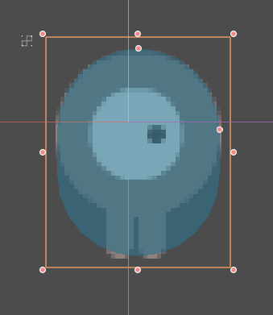

# Your First Game (2D)

## Overview

This tutorial will guide you through making your first Godot Engine project. You will learn how the Godot Engine editor works, how a project is structured, and how to build a basic 2D game.

The game is called _"Dodge the Creeps"_. Your character must move and avoid the enemies for as long as possible.  Here is a preview of the final result:

**!IMG: GIF PREVIEW!**

>   **Why 2D?**
>    Beginners are urged to focus on 2D projects until they have a good understanding of the game development process. 3D games are significantly more complex, so stick to 2D until you feel confident in your ability.

## Project Setup

Start by launching Godot and making a new project. Then, download the **!LINK TO ASSETS!** _game assets_ - the images and sounds you'll be using.  Unzip these files in your new project folder.

>   For this tutorial, we will assume you are already familiar with the Godot Engine editor window. If you haven't read the **!LINK TO EDITOR OVERVIEW!**, do so now.

#### Organizing the Project

In this project, we will be making 3 independent scenes: `Player`, `Mob`, and `HUD`, which we will combine into the game's `Main` scene.  In a larger project, it might be useful to make folders to hold the various scenes and their scripts, but for this simple game, you can save everything in the root folder, which is called `res:\\`.

## Player Scene

#### Node Structure
Add the following nodes to the scene:

`Area2D`
    - `AnimatedSprite`
    - `CollisionShape2D`

The `Area2D` node will represent our player.  We are using `Area2D` so that we can detect other objects colliding (i.e. running into) the player. A more complex physics body is not necessary, since we don't need to worry about bouncing or pushing the player.

Change the name of the `Area2D` node to `Player` and save the scene (click Scene -> Save, or press `Meta-s`).

#### Sprite Animation
The `AnimatedSprite` will handle the animations for our player. Notice that there is a warning symbol next to it.  An `AnimatedSprite` requires a `SpriteFrames` resource, which is a list of the animation(s) it can display. To create one, find the `Frames` property in the Inspector and click `<null>` -> `New SpriteFrames`. Next, in the same location, click `<SpriteFrames>` to open the "SpriteFrames" editor window:

Finally, add a shape to the `CollisionShape2D`. For this character, a `CapsuleShape2D` gives the best fit:

**!IMG: COLLISION SHAPE SCREENSHOT!**

#### Adding a Script

## Enemy Scene

#### Node Setup

#### Enemy scripts
## Main Scene

Instancing
    - Player (in GUI)
    - Mobs (in code)

## HUD

## Finishing Up
