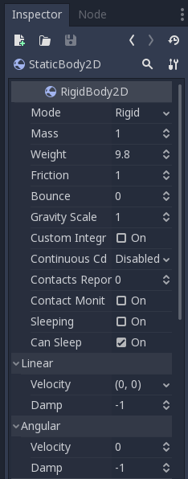

# Guide to Physics Bodies

## Overview

Godot offers a variety of "collision objects" to choose from. Choosing which one to use for your project can be confusing. In this guide, we'll explore the pros and cons of each to help you make the right choice for your object.

As you read this guide, refer to the following table as a summary of how the various bodies are differentiated:

||Controlled by Physics Engine|Controlled by code|
|--|--|--|
|**Collide during movement**|`RigidBody2D`|`KinematicBody2D`|
|**No collision during movement**|`StaticBody2D`|`Area2D`|

> **Note:** While 2D objects are listed here, the same general principles apply to the equivalent 3D (`Spatial`) nodes.
 
## CollisionObject2D

`CollisionObject2D` is the base class for all of the bodies discussed here. You don't use this node directly, but all the node types below inherit properties from it.

### Adding Collision Shapes

`CollisionObject2D`s can hold any number of `Shape2D` objects as children. These shapes are used to define the object's collision bounds and detect contact with other objects. In order to detect collisions and/or contacts, at least one `Shape2D` must be assigned. The most common way to do this is by adding a `CollisionShape2D` or `CollisionPolygon2D` as a child. These nodes allow you to draw the shape directly in the editor workspace.

### Collision Layers and Masks


## Area2D

`Area2D` is a general-purpose node for area detection and area influence.

Common uses:

-   detecting "enter" and "exit" events for other shapes and bodies moving in the world
-   altering 2D physics properties such as gravity or damping
-   detection of other overlapping areas

## PhysicsBody2D

The remaining three body types derive from `PhysicsBody2D`, an abstract base class. You will never access this class directly, only choose one of the three body types below.

### StaticBody2D

A static body is a body that is intended to remain stationary relative to the game world. It participates in collision detection, but does not move or rotate after colliding.

StaticBodies are most often used for objects that are part of the environment, such as platforms or walls.

### KinematicBody2D

`KinematicBody2D` is for implementing bodies that are to be controlled by the user (or code).  They can detect collisions with other bodies when moving, but are not affected by physics.

When moving a `KinematicBody2D`, you cannot set its `position` directly.  Instead, you must use the `move_and_collide()` or `move_and_slide()` methods. These methods will move the body along a given vector, but will instantly stop if a collision is detected with another body.

#### Collision Response

After a KinematicBody2D has collided, it is common to calculate some kind of _collision response_. You may want the body to bounce, to slide along a wall, or to alter the properties of the object it hit. The way you handle collision response depends on which method you used to move the KinematicBody2D.

When using `move_and_collide`, the function will return a [KinematicCollision2D] object, which contains information about the collision and the colliding body.  You can use this information to determine the response.

For example, if you want to the point in space where the collision occurred:
```
func _physics_process(delta):
    var collision_info = move_and_collide(velocity * delta)
    if collision_info:
        var collision_point = collision_info.position
```

### RigidBody2D

This is the node that implements full 2D physics. This means that you do not control a `RigidBody2D` directly. Instead you can apply forces to it (gravity, impulses, etc.), and the physics simulation will calculate the resulting movement, collision, bouncing, rotating, etc.

A RigidBody's behavior is controlled by properties such as "Mass", "Friction", or "Bounce", which can be set in the Inspector:



The body's behavior can be affected by the world, via the `Project Settings -> Physics` properties, or by an [Area2D] which is overriding the global physics properties.

#### RigidBody Modes

A RigidBody can be set to one of four modes:

-   **Rigid** - The body behaves as a physical object, colliding with other bodies, and responds to forces applied to it. This is the default mode.
-   **Static** - In this mode, the body behaves like a [StaticBody2D] and does not move.
-   **Character** - Similar to `Rigid` mode, but the body can not rotate.
-   **Kinematic** - The body behaves like a [KinematicBody2D], and must be moved by code.

#### Using RigidBody2D

One of the benefits of using a rigid body is that a lot of behavior can be gotten without writing any code. For example, if you were making an "Angry Birds"-style game with falling blocks, you would only need to create RigidBody2Ds and adjust their properties.

However, if you do wish to have some control over the body, you can use should take care - altering the `position` or `linear_velocity` can result in unexpected behavior. If you need to use the `_integrate_forces()` callback.

For example, here is the code for an "Asteroids" style ship:

```
extends RigidBody2D

var thrust = Vector2(0, 250)
var torque = 20000

func _integrate_forces(state):
    if Input.is_action_pressed("ui_up"):
        set_applied_force(thrust.rotated(rotation))
    else:
        set_applied_force(Vector2())
    var rotation_dir = 0
    if Input.is_action_pressed("ui_right"):
        rotation_dir += 1
    if Input.is_action_pressed("ui_left"):
        rotation_dir -= 1
    set_applied_torque(rotation_dir * torque)
```

Notice that we are not setting the `linear_velocity` or `angular_velocity` properties directly, but rather applying forces (`thrust` and `torque`) to the body, and letting the physics engine calculate the resulting movement.
